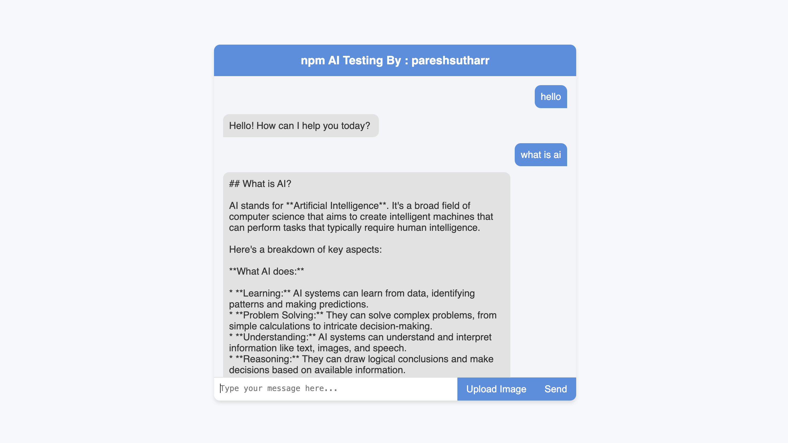

# Google AI Integration with Node.js



## Overview

This project is a Node.js application that integrates Google's Generative AI for generating responses to text inputs and processing images. It uses the `@google/generative-ai` npm package for AI functionalities and Express.js for setting up a web server.

## Features

- **Text-Based AI Responses:** Generate text responses based on user input using Google's Generative AI.
- **Image Processing:** Handle and process images sent by users.
- **REST API:** Expose a REST API for interacting with the AI functionalities.

## Prerequisites

- Node.js (v12 or later)
- npm (v6 or later)
- Google API Key with access to Generative AI

## Installation

1. Clone the repository:
    ```bash
    git clone https://github.com/pareshsutharr/googleAIWeb.git
    cd googleAIWeb
    ```

2. Install the dependencies:
    ```bash
    npm install
    ```

3. Set up environment variables:
    - Create a `.env` file in the root directory.
    - Add your Google API key to the `.env` file:
        ```
        GOOGLE_API_KEY=your_google_api_key
        ```

## Usage

1. Start the server:
    ```bash
    npm start
    ```

2. Open your browser and navigate to `http://127.0.0.1:3000` to access the web interface.

3. Use the provided form to send text or image inputs to the AI and receive responses.

## API Endpoints

### POST /api/chat

- **Description:** Handles both text and image inputs.
- **Request Body:**
    ```json
    {
        "message": "Your text message",
        "image": "data:image/png;base64,yourBase64ImageData"
    }
    ```
- **Response:**
    ```json
    {
        "reply": "AI-generated text response",
        "image": "data:image/png;base64,processedBase64ImageData"
    }
    ```

## Code Explanation

### Google Generative AI Integration

Instantiate the Google Generative AI with your API key:

```javascript
const genAI = new GoogleGenerativeAI(process.env.GOOGLE_API_KEY);
